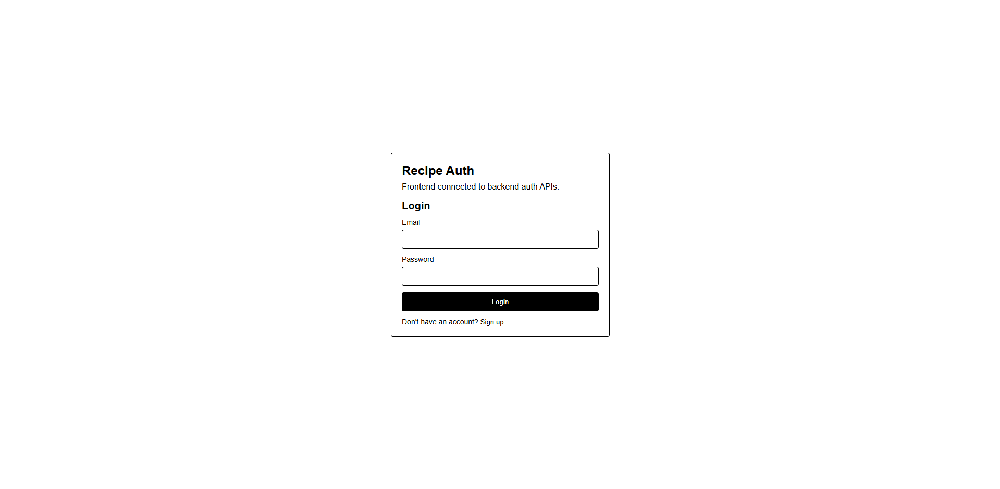
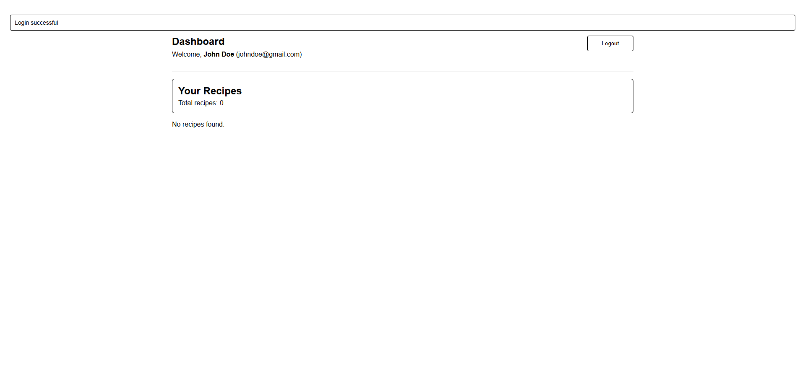

# Recipe Web (MERN)

A beginner-friendly full-stack recipe project with:
- Backend: Node.js, Express, MongoDB, JWT cookie auth
- Frontend: React + Vite
- Simple auth flow (register/login/logout)
- Dashboard page that shows the logged-in user's recipes

## Tech Stack

- Node.js
- Express
- MongoDB + Mongoose
- JWT (`jsonwebtoken`)
- React (Vite)
- Axios

## Photo



## Video
<video src="./frontend/src/assets/Demo.mp4" controls width="100%"></video>

[Download/Watch Video](./frontend/src/assets/Demo.mp4)

## Project Structure

```text
Recipe_web-main/
  backend/
    server.js
    index.js
    src/
      config/
      controllers/
      middleware/
      models/
      routes/
      scripts/
      utils/
  frontend/
    src/
      App.jsx
      index.css
```

## Prerequisites

- Node.js 18+
- npm
- MongoDB running locally or a MongoDB Atlas connection string

## Environment Variables

Create `backend/.env`:

```env
PORT=3000
DB_URI=mongodb://127.0.0.1:27017/recipe_app
CORS_ORIGIN=http://localhost:5173
ACCESS_TOKEN=replace_with_strong_access_secret
REFRESH_TOKEN=replace_with_strong_refresh_secret
ADMIN_NAME=Admin
ADMIN_EMAIL=admin@example.com
ADMIN_PASSWORD=change_this_admin_password
```

## Installation

### 1) Install backend dependencies

```bash
cd backend
npm install
```

### 2) Install frontend dependencies

```bash
cd ../frontend
npm install
```

## Run the Project

You need two terminals.

### Terminal 1: Backend

```bash
cd backend
npm run dev
```

Backend runs on: `http://localhost:3000`

### Terminal 2: Frontend

```bash
cd frontend
npm run dev
```

Frontend runs on: `http://localhost:5173`

## Current Features

- Register a user
- Login user
- Logout user
- JWT stored in HTTP-only cookies
- Dashboard shown after login
- Dashboard lists logged-in user's recipes

## API Routes

### Auth routes

Base: `/api/auth`

- `GET /` -> health check for auth API
- `POST /register` -> create user
- `POST /login` -> login user and set cookies
- `POST /logout` -> logout user (requires auth)

### Recipe routes

Base: `/api/receipe`

- `GET /` -> health check for recipe API
- `GET /my` -> logged-in user's recipes
- `POST /` -> create recipe (user/admin)
- `PUT /:id` -> update recipe (owner/admin)
- `GET /admin/all` -> all recipes (admin)

Note: The route prefix is currently `/api/receipe` in code.

## Scripts

### Backend (`backend/package.json`)

- `npm run start` -> start server
- `npm run dev` -> start server with watch mode

### Frontend (`frontend/package.json`)

- `npm run dev` -> start Vite dev server
- `npm run build` -> production build
- `npm run preview` -> preview production build
- `npm run lint` -> run ESLint

## Troubleshooting

- `EADDRINUSE: address already in use :::3000`
  - Port 3000 is busy. Stop the running process or change `PORT` in `backend/.env`.

- MongoDB connection issues
  - Verify `DB_URI` and ensure MongoDB service is running.

- CORS/cookie auth issues
  - Ensure `CORS_ORIGIN` matches frontend URL (`http://localhost:5173`).

## Future Improvements

- Add `GET /api/auth/me` for session restore on page refresh
- Add create/edit/delete recipe UI in dashboard
- Normalize naming from `receipe` to `recipe`
